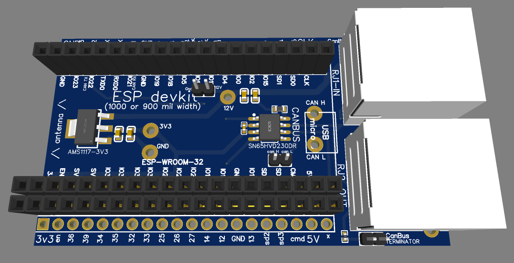
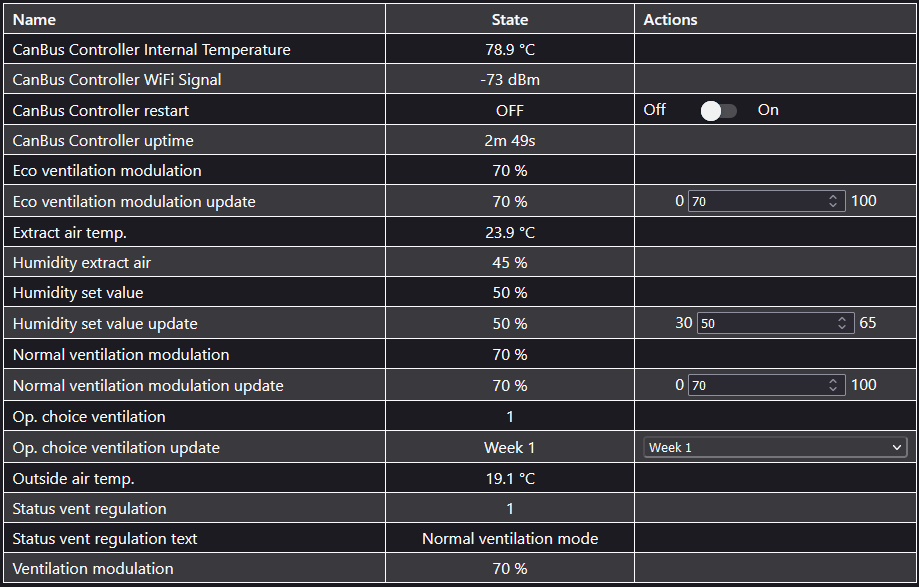
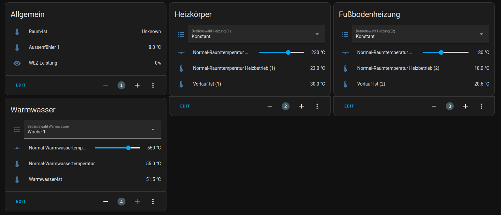

# An ESP32 CanBus shield - made for hoval homevent, but for all canbus applications

<!---[](https://github.com/nliaudat/esp_canbus/wiki)
[](https://github.com/nliaudat/esp_canbus/actions?query=workflow%3ABuild+branch%3Amain)-->

> **⚠️ New core version — major refactor**
>
> This is a major refactor of the firmware, targeting a future submission to the
> official ESPHome components. The original firmware remains available on the
> [`legacy`](https://github.com/nliaudat/esp_canbus/tree/legacy) branch.
>
> Key changes:
>
> - **Presets moved into the component** (`esphome/components/toptronic/presets/`),
>   with multi-language support (`de`/`en`/`fr`/`it`) and many upgrades.
> - **`config.yaml` changed** — you can now define **multiple `toptronic:` components**
>   (one per CAN device, e.g. `HV`, `BM`, `WEZ`).
> - Improved multi-frame reassembly, CRC validation, OTA pause/resume, a non-blocking
>   post-boot refresh, and a thread-safe FreeRTOS command bridge.

**Migrating from `legacy`?** Device addressing moved from each entity to the hub,
entities are now auto-generated from the presets, and the config is multi-hub.
See the [component reference](esphome/readme.md) for details. Protocol
documentation, CRC reverse-engineering notes, and review references live in
the [`docs`](docs/) folder.




    
## Functionalities : 
* Compatible with 1000 or 900 mil width ESP devkit
* Full headers for extending or debug
* The card use a ESP32-WROOM-32D as logics and wifi connection. (You can get a 32U if you want an external antenna)
* The software runs under esphome to be easy to customize and linked with https://www.home-assistant.io 
* Power is taken from CanBus 12V and converted to 3.3v with AMS1117-3.3V (not needed but recommended, if cutting the "3v3V cutout", you can use external power supply)
* SN65HVD230 3.3-V CAN Bus Transceivers

## Fabrication : 

* PCB can be ordered with chips assembled at JLPCB for 50$ for 5 boards.
* ESP32-WROOM-32D costs approx 3.8$
* Box is 3D printed or fit in a 86x86 electrical box

## Firmware

<p align="center">
    
    <!--  -->
    <br />
    <i>web interface at http://canbus.local/</i>
</p>

### Features

* Powered by [ESPHome](https://esphome.io/)
* Webserver enabled at [canbus.local](http://canbus.local/)
* Automatically recognized by [Home Assistant](https://www.home-assistant.io/)

### Installation

#### Requirements

Make sure you have Python and ESPHome installed. <br />
To install ESPHome you can follow the [manual installation guide](https://esphome.io/guides/installing_esphome) or use [Docker](https://esphome.io/guides/getting_started_command_line#installation).

You can validate your installation by running

```bash
> esphome version
Version: 2026.7.0
```

#### Firmware configuration

Before flashing, the following files need to be customized for **your**
installation. All of them live in the `esphome/` folder.

##### 1. `esphome/secrets.yaml` — REQUIRED (create it)

This file is **gitignored** — it is never committed. Create it in
`esphome/secrets.yaml` with your WiFi credentials:

```yaml
wifi_ssid_1: "your_main_wifi"
wifi_password_1: "your_main_password"
wifi_ssid_2: "your_second_wifi"
wifi_password_2: "your_second_password"
wifi_ssid_3: "your_third_wifi"
wifi_password_3: "your_third_password"
fallback_hotspot_password: "your_fallback_ap_password"
```

> If you have fewer networks, leave the unused entries — ESPHome only uses the
> networks that are actually listed in `packages/wifi.yaml`.

##### 2. `esphome/config.yaml` — REQUIRED

Open `config.yaml` and adjust:

- `substitutions:`
  - `name` — used as the device name / mDNS hostname (`canbus` → `http://canbus.local/`)
  - `friendly_name` — shown in Home Assistant
  - `can_tx_pin` / `can_rx_pin` — your CAN transceiver wiring (defaults `GPIO22`/`GPIO21`)
  - `board_type` — your ESP32 devkit (default `az-delivery-devkit-v4`)
  - `TZ` — your timezone (default `Europe/Zurich`)
  - `toptronic_hubs` — **must list every hub id** you declare below; it is used by
    `board.yaml` (OTA pause/resume) and `button.yaml` (refresh-all) via a Jinja loop.
- `toptronic:` — one block **per device** (device type + address). You can find the
  address of each Hoval device in your room control unit under maintenance
  (e.g. `HV(8)`, `BM(8)`, `WEZ(1)`). All available presets are listed in
  [`esphome/components/toptronic/presets`](esphome/components/toptronic/presets).

Example exposing both an HV and a BM device:

```yaml
substitutions:
  name: canbus
  # ...

  ### toptronic hubs — used by board.yaml OTA pause/resume and button.yaml refresh all
  toptronic_hubs:
    - toptronic_HV
    - toptronic_BM

toptronic:
  - id: toptronic_HV  # HomeVent
    canbus_id: cbus  # the canbus bit_rate must be 50kbps. do not change name as it used in canbus.yaml
    device_type: HV  # WEZ, HV, BM (BD is an alias for BM and BM must be used)
    device_addr: 8  # defaults are : HV=8, BM=8, WEZ=1
    language: en  # de, en, fr, it
    boot_refresh_delay: 30s  # optional; one-shot full refresh after boot; 0 disables it
    # max_pending_messages: 32  # optional; max concurrent multi-frame reassemblies (per hub)
    # max_pending_age: 5000ms  # optional; a pending message this old with no continuation is lost
    # cleanup_interval: 5000ms  # optional; interval between stale-fragment sweeps
    # max_refresh_per_loop: 8  # optional; GET burst budget per refresh_gap_ms window
    # max_frames_per_message: 8  # optional; max total frames a start frame may claim
    # refresh_gap_ms: 50ms  # optional; refresh window; GET spacing = window / burst budget

  - id: toptronic_BM  # display
    canbus_id: cbus  # the canbus bit_rate must be 50kbps
    device_type: BM
    device_addr: 8
    language: en
    # boot_refresh_delay: 30s  # optional; one-shot full refresh after boot; 0 disables it
    # max_pending_messages: 32  # optional; max concurrent multi-frame reassemblies (per hub)
    # max_pending_age: 5000ms  # optional; a pending message this old with no continuation is lost
    # cleanup_interval: 5000ms  # optional; interval between stale-fragment sweeps
    # max_refresh_per_loop: 8  # optional; GET burst budget per refresh_gap_ms window
    # max_frames_per_message: 8  # optional; max total frames a start frame may claim
    # refresh_gap_ms: 50ms  # optional; refresh window; GET spacing = window / burst budget
```

All seven options are optional. Their defaults are: `boot_refresh_delay: 30s`,
`max_pending_messages: 32`, `max_pending_age: 5000ms`,
`cleanup_interval: 5000ms`, `max_frames_per_message: 8`,
`refresh_gap_ms: 50ms`, `max_refresh_per_loop: 8`. They tune the
multi-frame reassembly buffer, the stale-fragment sweep, the throttled refresh
burst, and the bogus-frame-count guard. The effective per-GET spacing of a
refresh burst is `refresh_gap_ms / max_refresh_per_loop` (default 50 ms / 8 =
6.25 ms). See the component reference (`esphome/readme.md` - hub configuration
table) for the full description of each.

> ⚠️ Every hub id in `toptronic_hubs` MUST match an `id:` in a `toptronic:` block —
> otherwise `esphome config` fails with an unknown-id error.

##### 3. `esphome/packages/wifi.yaml` — usually REQUIRED

This package contains the WiFi networks referenced by `secrets.yaml`. Add /
remove network entries to match your environment, and uncomment `hidden: true`
for hidden SSIDs. The fallback hotspot SSID is derived from `name`
(`<name> Fallback`, e.g. `canbus Fallback`) and uses
`fallback_hotspot_password` from `secrets.yaml`.

##### 4. `esphome/packages/board.yaml` — OPTIONAL

- `esp32.board` comes from the `board_type` substitution in `config.yaml`
  (e.g. `az-delivery-devkit-v4`, `nodemcu-32s`, `esp-wrover-kit`) — change it there,
  not here.
- The `api:`, `ota:`, and `safe_mode:` blocks are usually left at their defaults.
- The OTA `on_begin`/`on_end`/`on_error` lambdas iterate over `toptronic_hubs` to
  pause/resume frame processing during updates — no change needed unless you want
  different watchdog/`sdkconfig` values.

##### 5. Other packages — usually leave as-is

`time.yaml` (SNTP + optional weekly reboot), `sensors_others.yaml` (WiFi signal /
internal temperature), `switch.yaml` (restart), `button.yaml` (refresh-all), and
`canbus.yaml` (50 kbps `esp32_can` platform). `debug.yaml` is **opt-in** — it
injects synthetic frames for testing and must be enabled manually in `config.yaml`.

> ℹ️ Candump and "find can_id" bus debugging are now available at runtime as two
> switches (see `esphome/packages/switch.yaml`): **"candump debug"** logs every CAN
> frame and **"find can_id debug"** logs only 0x42/0x40 frames (results also land
> in the "main logs" text sensor). Turn them on for a short debug session only —
> they add bus/log latency and reset to off on every reboot. The old commented-out
> `on_frame` blocks in `canbus.yaml` are kept for reference only and are superseded.

If you want to create your own preset or need other datapoints, have a look at
[`hoval_data_processing`](hoval_data_processing/).

#### Flash the firmware

Connect your ESP32 via USB to your computer. (Only required for the first time, subsequent installations can be done over WiFi) <br />
Then run `esphome run config.yaml`

## Note: 
For HomeVent : 
* Canbus Normal ventilation modulation works only in "Constant operation mode" 
* Canbus Eco ventilation modulation works only in "Eco operation mode" 
* Week 1 and Week 2 must be setup in homevent


## License
This project is licensed under the Apache-2.0 license
